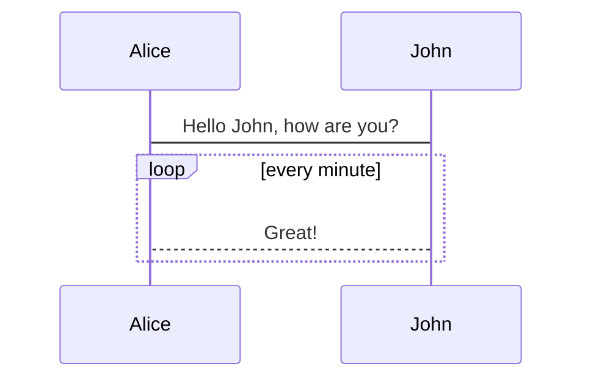

>  :::info 
> 本文轉載自舊站存檔。
> :::


# 前言

<ruby><font  color="lightblue"><del>回顧系列</del></font><rp>(</rp><rt><font  color="red">薪水小偷</font></rt><rp>)</rp></ruby>系列又來了...因為不知道要弄什麼，所以乾脆Dig-in現在的NexT主題來看看有沒有什麼好玩的...


<!--truncate-->

# 修改內容

## Codeblock - Code fence效果調整

### 設定變更處

```json
codeblock:
  # Code Highlight theme
  # All available themes: https://theme-next.js.org/highlight/
  theme:
    light: default
    dark: tomorrow-night
  prism:
    light: prism
    dark: prism-dark
  # Add copy button on codeblock
  copy_button:
    enable: true
    # Available values: default | flat | mac
    style: mac
```

### 效果圖

#### 使用Default/Flat效果如下


#### 使用Mac效果如下


看起來還是用Mac比較騷一點.....

## Tag效果調整

### 設定變更處

```bash
# ---------------------------------------------------------------
# Tags Settings
# See: https://theme-next.js.org/docs/tag-plugins/
# ---------------------------------------------------------------

# Mermaid tag
mermaid:
  enable: ture
  # Available themes: default | dark | forest | neutral
  theme:
    light: default
    dark: dark
```

### 效果圖

#### 啟用Mermaid繪圖

##### Markdown Code

```bash
#```mermaid                                 #這個要用code fence語法表示
sequenceDiagram
    Alice->John: Hello John, how are you?
    loop every minute
        John-->Alice: Great!
    end
#```
```

##### 實際效果



#### 不同風格 - default

##### Light theme


##### Dark theme


#### 不同風格 - dark

##### Light theme


##### Dark theme


#### 不同風格 - forest

##### Light theme


##### Dark theme


#### 不同風格 - neutral

##### Light theme


##### Dark theme


我後來發現可能是我的Dark theme.js有問題，當Mermaid theme light & Dark設定不一樣的時候會只render light theme的樣式..所以我最終採用都一樣的dark theme

# 結論...

就是閒的蛋疼...實際上我也不怎麼用Mermaid畫圖就是了...