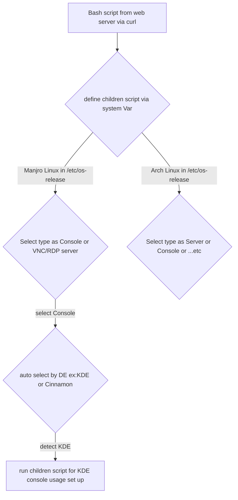

>  :::info 
> 本文轉載自舊站存檔。
> :::

# 前言

很久沒有更新我的Blog了,雖然說主要的原因是我懶但是也不代表我啥都沒幹...   

<!--truncate-->

# 廢話園地

最近我雖然沒有更新Blog但是發生了不少事情

* 去東南亞爽了一圈 - 馬來西亞 & 泰國

* Universal script撰寫

這兩件事算是整個九月下旬到今天為止比較值得寫的

# 東南亞

其實也沒什麼,就是工作出差的名義去了趟馬來西亞跟泰國

## 馬來西亞

老實說,雖然我盡量讓自己沒有偏見,但是的確發現我有對東南亞的偏見存在,本來以為馬來西亞的基建什麼的會輸台灣一大截,結果去了當地發現小丑竟然是我自己...

馬來西亞有著相當好的基建,以及整體給人悠閒但又不貧困的感覺,電子支付更是領先台灣好幾條街....說真的讓人有台灣再不長進就輸一屁股的感覺...

## 泰國

我對泰國的印象還停留在2014年，這次去發現他們的一些電子化作的還不錯...另外可能是這次住的地方是Pattaya的關係感覺比較沒有以前在碧武里那種鄉下感

不過因為現在台灣也可以輕鬆買到PCHome Thai上的東西，反而不覺的需要買很多土產回家...

# Universal Script

其實嚴格來說真的值得寫的是這玩意，這個其實就是把我以前寫過的`Arch Linux Automatic Install Script`的放大版,企圖是把我自己會使用的Unix-like OS都塞進去

目前（預計）涵蓋的範圍

* Manjaro Linux with Desktop for Console and VNC/RDP server
  
  * KDE(90％完成)
  
  * Xfce(0%完成)
  
  * Gnome(0%完成) - 考慮是不是要拿掉
  
  * Cinnamon(0%完成)

* Fedora Linux with Desktop for Console and VNC/RDP server (0%)

* Linux Mint with Desktop for Console and VNC/RDP server(0%) - 考慮是否要留

* Arch Linux (0%)

* Photon OS(0%)

* FreeBSD(0%)

## 概念與作法

其實就是先寫一個自動判別的script導向對應的子script去進行設定或安裝

大致上就是上面這個圖的邏輯

現在的進度大致上就是最初的那個選別script我寫好了,然後manjaro的部份核心寫好了(以KDE為主的)其他DE的內容就還需要裝上該版本後再fine tune

## 其他收穫

### Script - if condition

這個大概是最近在寫script的時候最常用到的功能..著實花了我一些時間去研究條件怎麼寫

## Script - source other script

這個功能算是很後期我才導入的,但是非常棒...基本上就是類似其他程式語言一樣可以把其他寫好的模組（或是重複性很高的code)另外獨立後以`source`的形式load進來搭配後面學會的`function`機能可以作到先load要用再呼叫該function的方式使用,甚至可以呼叫的時候加上其他變數

## Script - function

這個算是比較花俏的script寫法本來的用意是拿來美化用的ex:banner or 選單之類的，不過後來發現什麼亂七八糟的都可以用function來導入...所以就開始亂搞了....

## VNC/RDP

最大的發現就是原來這兩個玩意可以共存一起跑....只要裝上該裝的東西後就可以了....

在Manjaro環境中需要tigervnc for vnc server, xrdp for rdp server

不過要注意一點要連接xrdp的時候不能預設把user name鍵入,會有問題需要空白進去後再key

## DE review

之前我是Manjaro XFCE for VNC然後console用Manjaro KDE, 然而今天發現GNOME其實跟我胃口不太合,於是我參考了LinuxMint試了一下Cinnamon發現其實還蠻ok的,尤其是可以利用`dconf dump /org/cinnamon > file.name`形式備份整個DE的設定...實在太開心了....

可能後面會嘗試把主力DE從KDE再改去Cinnamon,不過Manjaro Cinnamon因為不是Official的版本所以中文化跟效能調校沒有弄的很好...很有機會需要花很多時間來fine tune....

# 結語

其實這段時間累積了不少可以寫的東西...但是真的是因為懶所以就簡化再簡化...等後面完成了再來拆解寫入Wiki好了...