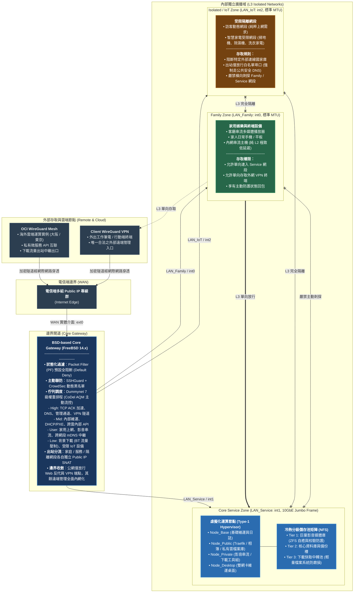

# Homelab架構

這是我這些年來不斷改進自家 Homelab 的架構，算是目前需求、電費與硬體成本平衡下的現狀。放在這裡只是留個存檔供人參考，若有興趣搭建類似架構的朋友歡迎一起交流。

---

## 1. 架構核心原則 (Design Tenets)

* **最低實際花費成本**  
  考慮到預算與電費，不太可能真的弄一堆實體機來跑家庭服務。整套架構的實體底座基本上就是**一台 Tower Server + 一台實體老 NAS + 白嫖來的 OCI 免費雲端實例**。
* **盡量原子化功能**  
  經歷過早期在單一主機塞入各種服務導致依賴打結、除錯火葬場的痛苦，全面導入 Container 容器化，並依照安全等級與使用需求對 Host 實施嚴格切割。
* **滿足松鼠癖**  
  我是個有松鼠症的人。沒有資金可以天天屯企業級硬體，那我就屯數位資料。所以整個架構可能不夠清爽、不夠斷捨離，但容量與資料分級絕對管夠。
* **滿足奇怪的虛榮心**  
  我知道市面上有很多開箱即用的套裝方案或商業軟體能輕鬆達成需求，但很遺憾我是活在 2000 年代的老人：**能用 FreeBSD 硬幹的我絕不去買現成 Router，能用 Linux 硬幹的我就不會去付費訂閱服務**。

---

## 2. 網路拓撲矩陣 (Topology Overview)

